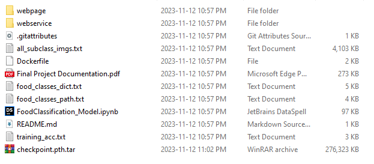

# LSML2-FP
 Final Project for LSML2

1. Download the required materials:

- Github Repository: https://github.com/naavie/LSML2-Public_FP
- Pre-trained ResNet-50 model: https://drive.google.com/uc?id=1JfJD0tFnnI3iOCQTP2lwnvmV8oPmsQXy&export=download

2. After downloading the Github repository, download the pre-trained ResNet-50 model by following the link
above and place the downloaded model into the same folder where the Dockerfile is. The ResNet-50 model is
saved as the file “checkpoint.pth.tar”

- NOTE: DO NOT EXTRACT “checkpoint.pth.tar”. Simply drag it into the main repository folder within your
workspace.

3. Step 3: Start your Docker Engine and run the following commands:
- docker build -t "<your image name>" .
- docker run -p 5000:5000 "<your image name>"

Please replace "<your image name>" with any name of your choosing and without the <> symbols. Please also
run the docker run command in a command prompt terminal. Do not run it within an integrated code editor like
VSCode/Vim/etc.

After you execute the docker run command, you can open the localhost:5000 on any web browser (Google
Chrome is recommended) and experiment with the ML-service.

All code runs on Python 3.8 and the list of necessary modules/libraries can be found in requirements.txt file.

All specific details on how to run and use the service can be found on the web service webpage